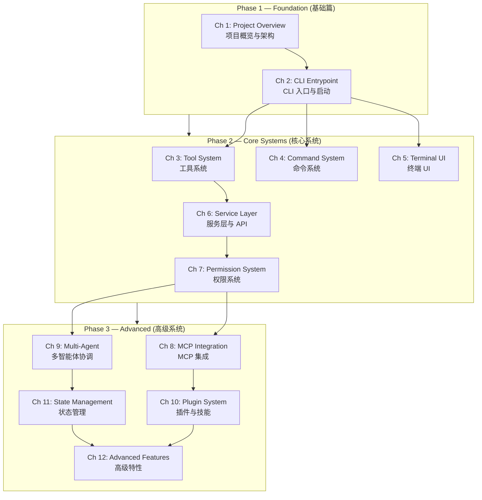

# Learning Roadmap / 学习路线图

This roadmap shows the recommended progression through the 12 chapters, organized into three phases.

本路线图展示了推荐的 12 章学习顺序，分为三个阶段。

---

## Visual Path / 可视化路径

---

## Phase 1 — Foundation / 基础篇

**Estimated time: 2-4 hours / 预计时间：2-4 小时**

Get a mental map of the entire codebase. You'll understand what Claude Code is, how its modules relate, and be able to trace the startup sequence from `claude` command to rendered UI.

建立整个代码库的心智地图。了解 Claude Code 是什么，各模块如何关联，并能追踪从 `claude` 命令到界面渲染的完整启动序列。

| Chapter | Focus | Time |
|---------|-------|------|
| Ch 1: Project Overview | Directory structure, module graph, tech stack | ~2h |
| Ch 2: CLI Entrypoint | Commander.js setup, parallel prefetch, first render | ~2h |

---

## Phase 2 — Core Systems / 核心系统

**Estimated time: 8-12 hours / 预计时间：8-12 小时**

Deep-dive into the five systems that make Claude Code functional day-to-day. Each chapter stands somewhat independently but builds on Phase 1.

深入研究让 Claude Code 日常运作的五个核心系统。每章相对独立，但都建立在第一阶段的基础上。

| Chapter | Focus | Time |
|---------|-------|------|
| Ch 3: Tool System | Tool interface, registry, execution pipeline | ~2h |
| Ch 4: Command System | Slash commands, registration, lazy loading | ~1.5h |
| Ch 5: Terminal UI | Ink/React, layout, component tree | ~2.5h |
| Ch 6: Service Layer | API client, streaming, token accounting | ~2h |
| Ch 7: Permission System | Modes, approval gates, security model | ~2h |

---

## Phase 3 — Advanced / 高级系统

**Estimated time: 10-16 hours / 预计时间：10-16 小时**

The cutting-edge features that push Claude Code beyond a simple assistant. Recommended to complete Phase 2 first, but Chapters 8-11 can be read in any order.

将 Claude Code 推向前沿的高级功能。建议先完成第二阶段，但第 8-11 章可按任意顺序阅读。

| Chapter | Focus | Time |
|---------|-------|------|
| Ch 8: MCP Integration | Protocol, server lifecycle, tool bridging | ~2.5h |
| Ch 9: Multi-Agent | Sub-agents, teams, swarm coordination | ~3h |
| Ch 10: Plugin System | Plugin loading, skill definition, conflict resolution | ~2.5h |
| Ch 11: State Management | State store, compression, memory persistence | ~3h |
| Ch 12: Advanced Features | Sandbox, voice, IDE bridge, remote agents | ~3h |

---

## Suggested Study Approach / 建议学习方式

1. **Read the chapter doc first** — get the concepts before touching code
2. **Run the examples** — `bun run ch1:structure` to see things live
3. **Cross-reference the source** — the docs include line-number pointers to the real code
4. **Take notes** — what surprised you? What would you have designed differently?

---

1. **先读章节文档** — 先理解概念，再接触代码
2. **运行示例** — `bun run ch1:structure` 看到实际效果
3. **对照源码** — 文档中包含指向真实代码的行号引用
4. **做笔记** — 什么让你感到意外？你会怎么设计得不同？
